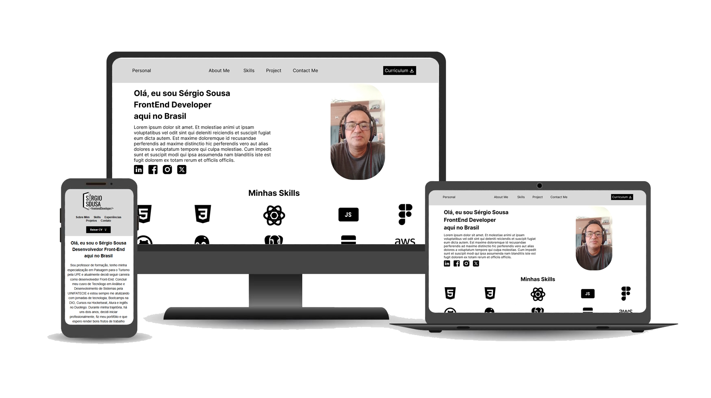

# 💼 Portfólio — Serjão Sousa

Portfólio pessoal desenvolvido para apresentar meus projetos, habilidades e experiências como **Desenvolvedor Front End**.  
Interface limpa, responsiva e focada em mostrar minha trajetória no mundo do código.

📸 Screenshots



🎥 **Vídeo Demonstração:** 
[Ver Vídeo](https://drive.google.com/file/d/1ZJPXJMSzfYgF_UGboJweMg1v6RJqFIVu/view?usp=sharing)

🔗 **Acesse online:** [portifoliosergiosousacode.netlify.app](https://portifoliosergiosousacode.netlify.app/)

🎨 **Protótipo no Figma:** [Ver protótipo](https://www.figma.com/proto/ux8qPpDddFM78JbjT3jxZO/portifolio-profissional?node-id=2-70&t=s2C3MNSJrgeJDCKs-1)

---

## 🧠 Tecnologias utilizadas
- HTML5  
- CSS3  
- JavaScript  
- Git & GitHub  
- Netlify
- Bootstrap

---

## ⚙️ Como rodar localmente
```bash
git clone https://github.com/sergiosousacode/portifolio.git
cd portifolio
# se usar npm:
npm install
npm run dev
# ou se for só HTML/CSS/JS estático, abre o index.html direto no navegador
```

🛠️ Próximos passos

Adicionar modo escuro
Criar versão multilíngue (pt/en)

🧩 Funcionalidades

- Apresentação pessoal
- Exposição dos principais projetos
- Links diretos para GitHub e redes
- Design responsivo para mobile e desktop

💷Integrar animações com JS ou React

🧾 Repositório GitHub: github.com/sergiosousacode/portifolio
💙 Feito com dedicação por Serjão Sousa